# muvautomation-secure-challenge

MVP académico para **Secure Product Challenge - Lab 3**. Simula la automatización de incidentes de CrowdStrike Falcon con datos completamente ficticios, sin conexión a CrowdStrike ni a servicios externos reales.

## Propósito y alcance

La aplicación publica una línea base intencionalmente insegura por HTTP plano y sin autenticación. El objetivo es que los equipos Red Team y Blue Team puedan observar peticiones, respuestas y logs durante el laboratorio. HTTPS, autenticación y rate limiting quedan para el Laboratorio 4.

La ruta de agregación imita la idea de `POST /alerts/aggregates/alerts/v1`, pero el endpoint local es `POST /api/alerts/aggregates` y solo consulta datos de esta base ficticia.

## Arquitectura

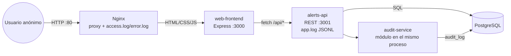

El diagrama editable está en [diagrams/architecture.md](diagrams/architecture.md). El límite de confianza de red está entre el usuario y Nginx; el límite de aplicación está entre Nginx/frontend y los servicios internos. Nginx genera los logs de acceso y error. `alerts-api` genera `app/alerts-api/logs/app.log` en JSON Lines.

## Estructura

```text
app/
├── web-frontend/       # dashboard Express, HTML/CSS/JS
├── alerts-api/         # API REST, PostgreSQL, schema, seed y logs
└── audit-service/      # módulo de auditoría usado por alerts-api
nginx/                  # configuración base y hardened
 diagrams/              # diagrama Mermaid
 evidence/              # evidencia Red Team, Blue Team y retest
 reports/zap-passive/   # exportaciones de ZAP pasivo
risk-register.md
```

`audit-service` no arranca un proceso separado: es un módulo local que escribe en `audit_log` y expone sus funciones a `alerts-api`. Esta decisión conserva la responsabilidad separada y reduce complejidad para el despliegue del laboratorio.

## Requisitos

- Node.js 18 o superior y npm.
- PostgreSQL 14 o superior nativo para el despliegue final.
- Nginx para publicar por HTTP.
- Docker opcional únicamente para levantar PostgreSQL durante el desarrollo local.

## Ejecución local

1. Instalar dependencias desde la raíz:

   ```bash
   npm install
   cp .env.example .env
   ```

   En Windows PowerShell, usar `Copy-Item .env.example .env` y, si se usa el `docker-compose.yml` incluido, cambiar localmente `DB_PASSWORD` a `postgres` para coincidir con la contraseña ficticia del contenedor. Nunca reutilizar ese valor fuera del desarrollo local.

2. Crear la base de datos `muvautomation_lab3` y cargar el esquema y datos ficticios:

   ```bash
   createdb -U postgres muvautomation_lab3
   npm run seed
   ```

   Alternativamente, para desarrollo local: `docker compose up -d postgres` y luego `npm run seed`.

3. Ejecutar los servicios en terminales separadas:

   ```bash
   npm run dev:api
   npm run dev:web
   ```

   El API queda en `http://127.0.0.1:3001` y el frontend en `http://127.0.0.1:3000`. El frontend consume rutas relativas `/api/*` y su servidor incluye un proxy local hacia `alerts-api`; Nginx se usa para la publicación integrada por HTTP.

4. Comprobar el API:

   ```bash
   curl http://127.0.0.1:3001/
   curl "http://127.0.0.1:3001/api/alerts?limit=10&offset=0"
   curl -X POST http://127.0.0.1:3001/api/alerts/aggregates -H "Content-Type: application/json" -d '{"date_ranges":[{}],"field":"severity"}'
   ```

## API pública ficticia

- `POST /api/alerts`: ingesta una alerta ficticia.
- `GET /api/alerts?limit=&offset=&severity=&status=`: lista y filtra alertas.
- `GET /api/alerts/:id`: detalle.
- `PATCH /api/alerts/:id/status`: body `{ "status": "new|in_progress|closed" }`; registra auditoría.
- `POST /api/alerts/aggregates`: body `{ "date_ranges": [{ "from": "...", "to": "..." }], "field": "severity|status|tactic" }`; registra auditoría.
- `GET /api/audit?limit=`: historial de auditoría de solo lectura.
- `GET /health`: estado del API y conexión a PostgreSQL.

El modelo `alerts` usa campos inspirados pero no equivalentes al esquema real de Falcon Alerts: `id`, `composite_id`, `severity`, `status`, `tactic`, `technique`, `hostname`, `description`, `created_timestamp` y `updated_timestamp`. Son nombres ficticios/simplificados para este laboratorio.

## Variables de entorno

La plantilla versionada está en [.env.example](.env.example). No colocar secretos ni credenciales reales.

| Variable | Uso |
|---|---|
| `DB_HOST` | Host PostgreSQL |
| `DB_PORT` | Puerto PostgreSQL |
| `DB_NAME` | Base de datos |
| `DB_USER` | Usuario local del laboratorio |
| `DB_PASSWORD` | Placeholder local; nunca subir un valor real |
| `PORT_WEB` | Puerto del frontend, por defecto 3000 |
| `PORT_API` | Puerto del API, por defecto 3001 |

## Despliegue en Ubuntu Server

1. Instalar Node.js, PostgreSQL y Nginx desde repositorios autorizados.
2. Crear la base de datos y cargar `app/alerts-api/db/schema.sql` y `app/alerts-api/db/seed.sql` con un usuario local de PostgreSQL.
3. Copiar el repositorio a `/var/www/muvautomation`, ejecutar `npm ci` y configurar `.env` con valores locales.
4. Ejecutar `npm start --workspace alerts-api` y `npm start --workspace web-frontend` mediante systemd o un supervisor de procesos.
5. Instalar `nginx/muvautomation.conf` en Nginx, validar con `nginx -t` y recargar el servicio. La variante `muvautomation-hardened.conf` conserva el proxy y añade headers defensivos para la fase de retest.
6. Revisar `/var/log/nginx/muvautomation_access.log`, `/var/log/nginx/muvautomation_error.log` y `app/alerts-api/logs/app.log` como evidencia Blue Team.

PostgreSQL debe ser nativo en el despliegue final. `docker-compose.yml` es solo una ayuda para desarrollo local.

## Evidencia y operación del laboratorio

- `evidence/red/`: reconocimiento autorizado, `curl`, Nmap y ZAP pasivo.
- `evidence/blue/`: logs y capturas filtradas, sin datos reales innecesarios.
- `evidence/retest/`: comparación tras aplicar la configuración hardened.
- `reports/zap-passive/`: reportes exportados de ZAP en modo pasivo.

## 5. Evidencias de ejecución local

Las siguientes capturas documentan la revisión local del repositorio y la ejecución
del frontend. La fecha visible en la evidencia corresponde al 14 de septiembre de
2026 en UTC.

### Estado del repositorio y archivos

Comandos solicitados:

```bash
git status
git log --oneline -5
find . -maxdepth 3 -type f
```

`git status` muestra que el repositorio está en la rama `main`, sincronizado con
`origin/main` y sin cambios pendientes:

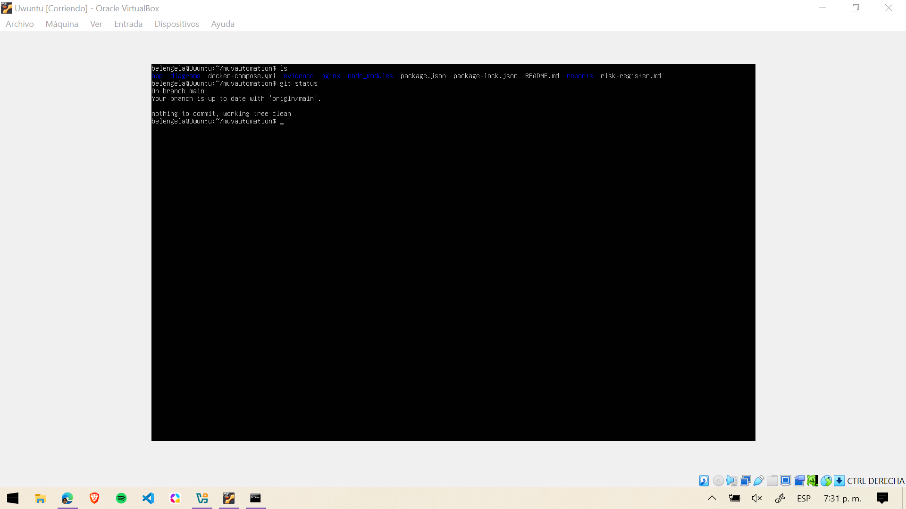

El historial identifica el commit que contiene la versión evaluada y los cambios
principales del laboratorio:

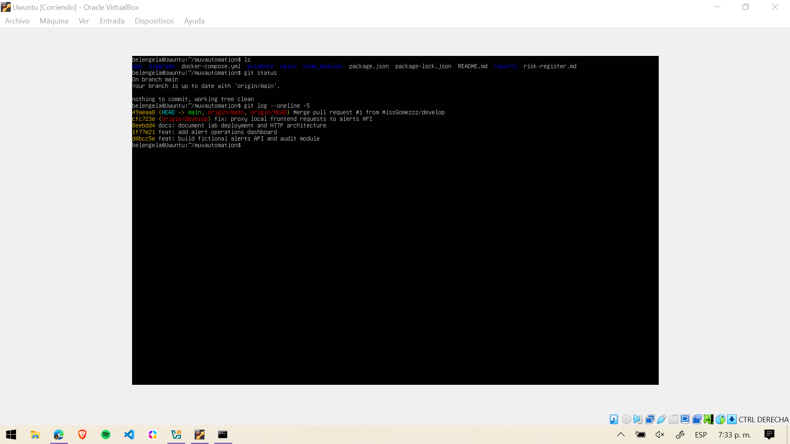

El listado confirma la existencia de `app/index.html` y de los archivos principales
del proyecto dentro del repositorio:

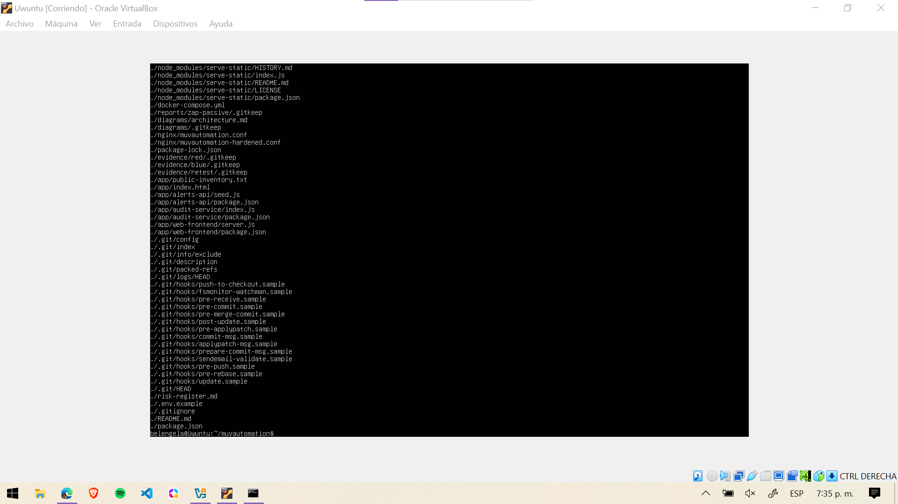

### Funcionamiento local y respuesta HTTP

El frontend se ejecutó localmente en `http://127.0.0.1:3000/` y se comprobó desde
el navegador:

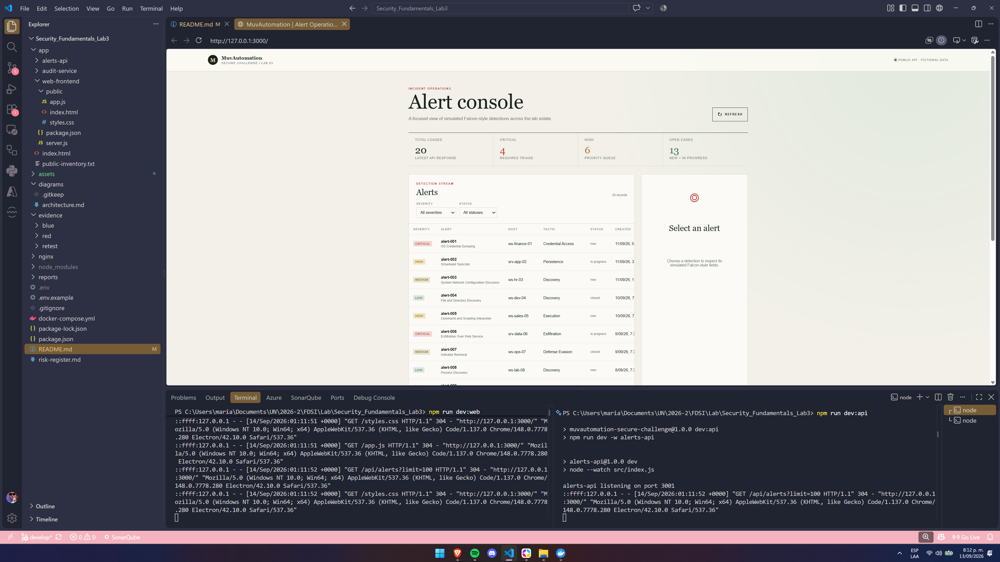

La respuesta obtenida con `curl` devuelve el documento HTML de la aplicación:

```bash
curl http://127.0.0.1:3000
```

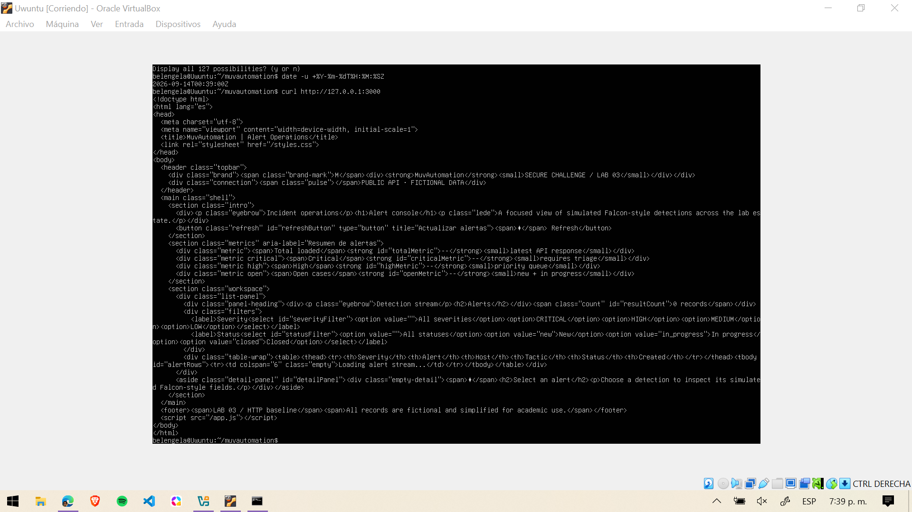

También se verificó la respuesta HTTP a través del punto publicado por Nginx:

```bash
curl -i http://127.0.0.1:8080/api/alerts
```

La captura muestra `HTTP/1.1 200 OK`, el servidor Nginx y la respuesta JSON del
endpoint:


La fecha y hora de la prueba se registraron con:

```bash
date -u +%Y-%m-%dT%H:%M:%SZ
```

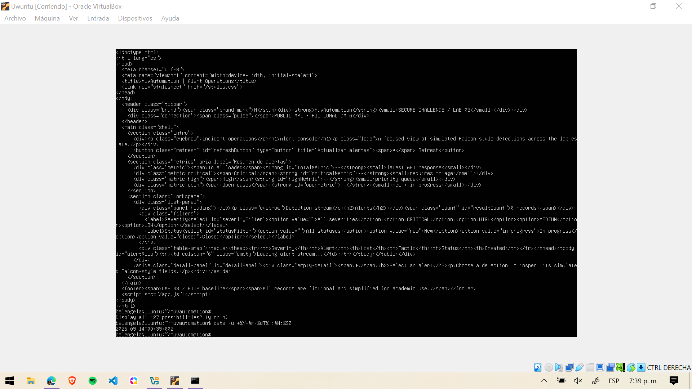

## 6. Evidencias del servidor y Nginx

Los servicios de la aplicación quedaron activos mediante PM2. La siguiente captura
muestra `alerts-api` y `web-frontend` en estado `online`:

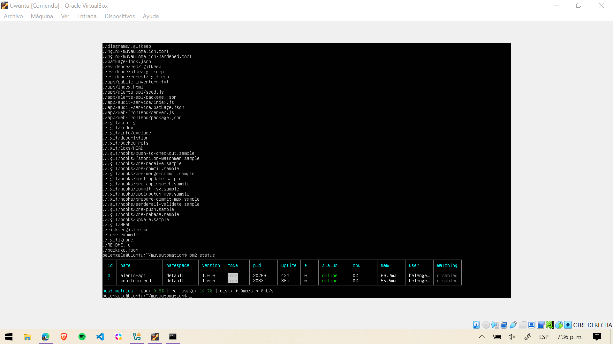

Esta segunda captura confirma el mismo estado operativo junto con el inventario del
proyecto en el servidor:

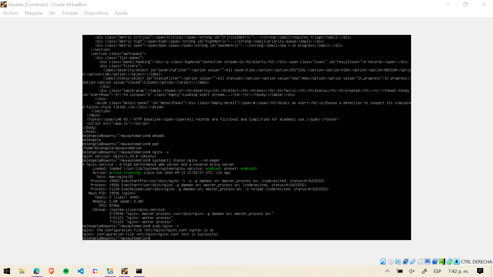

La comprobación del entorno del servidor incluyó `whoami`, `pwd`, la versión de
Nginx, el estado del servicio y la validación de sintaxis:

```bash
hostname
whoami
pwd
nginx -v
systemctl status nginx --no-pager
sudo nginx -t
```

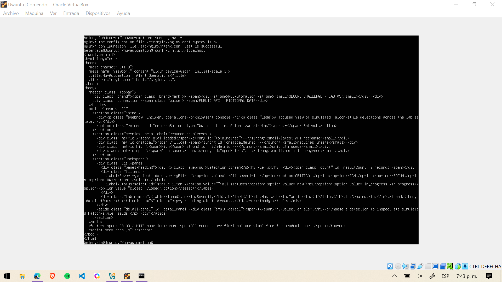

La respuesta de la API publicada por Nginx se verificó desde otro equipo mediante
`curl`, usando la dirección `http://127.0.0.1:8080/api/alerts`:

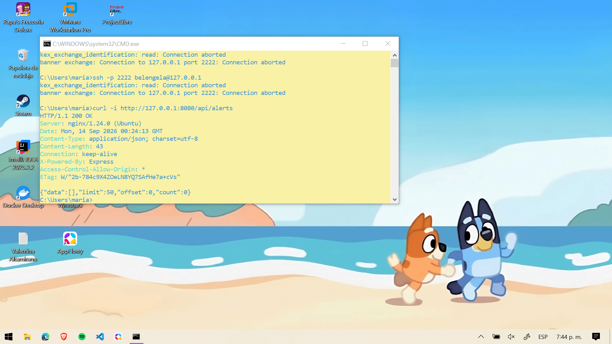

La misma dirección se abrió en el navegador para confirmar la publicación visual de
la aplicación:

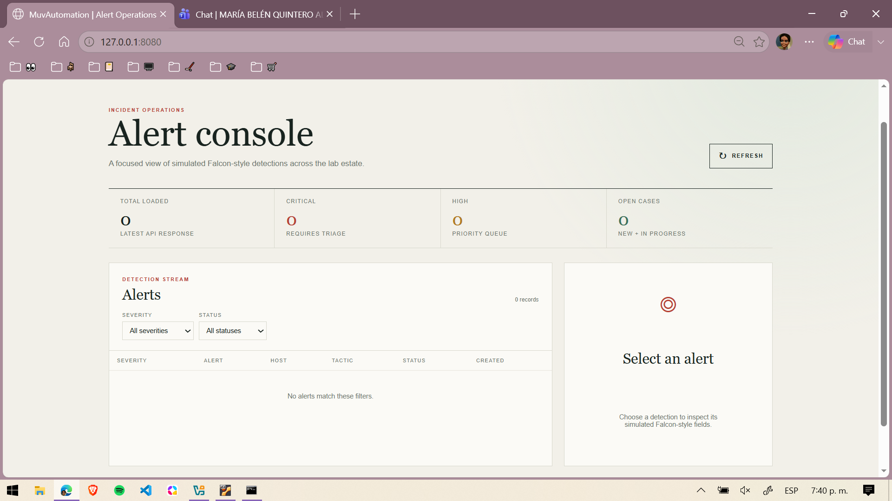

La respuesta HTML también se obtuvo desde el servidor con `curl` contra el frontend
local, lo que confirma el contenido publicado:


La configuración utilizada se encuentra versionada en
[`nginx/muvautomation.conf`](nginx/muvautomation.conf) y la variante endurecida en
[`nginx/muvautomation-hardened.conf`](nginx/muvautomation-hardened.conf). Los
extractos de `access.log`, `error.log` y la comprobación de permisos del directorio
publicado deben conservarse en `evidence/blue/` como archivos de texto para
completar la entrega de evidencias del servidor.

No se incluyen contraseñas, tokens, llaves privadas ni secretos en estas capturas.

## Limitaciones de seguridad conocidas

Estas limitaciones son intencionales y forman parte del Lab 3:

- HTTP sin cifrar; no usar en producción.
- Sin autenticación ni autorización.
- CORS abierto en `alerts-api`.
- Sin rate limiting ni protección anti-abuso.
- API pública con datos ficticios y endpoints de modificación.
- Logs locales sin pipeline centralizado ni retención configurada.
- Los placeholders de `.env.example` no son credenciales utilizables.

Las mitigaciones de HTTPS y autenticación se implementarán en el Laboratorio 4. No usar este prototipo con datos personales, tokens, API keys o credenciales reales.

## Integrantes

- Equipo del laboratorio: completar nombres y roles antes de la entrega.

## Commits de evidencia

Los cambios del MVP se organizan en commits pequeños por slice funcional. Verificar la historia con:

```bash
git log --oneline --decorate -n 10
```

## Uso responsable de IA

Antes de compartir logs, PCAP, IP, hostnames o usuarios con una herramienta de IA, anonimizar los datos del laboratorio. Validar manualmente toda conclusión contra el código, los comandos y la evidencia recolectada.
