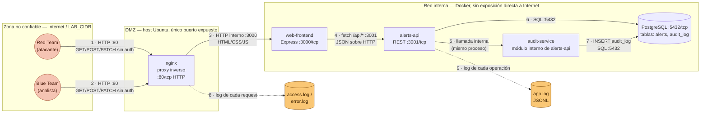

# Diagrama de arquitectura

En el diagrama es posible identificar los siguientes elementos: 

- Actores.
- Componentes.
- Flujos de datos.
- Protocolo.
- Puertos.
- Almacenes de datos.
- Límites de confianza.
- Punto de generación de logs.