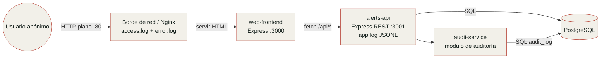

# Diagrama de arquitectura

Límites de confianza: el borde de red está entre el usuario y Nginx; el borde de aplicación está entre Nginx/frontend y los servicios internos. Todos los datos y nombres son ficticios.
